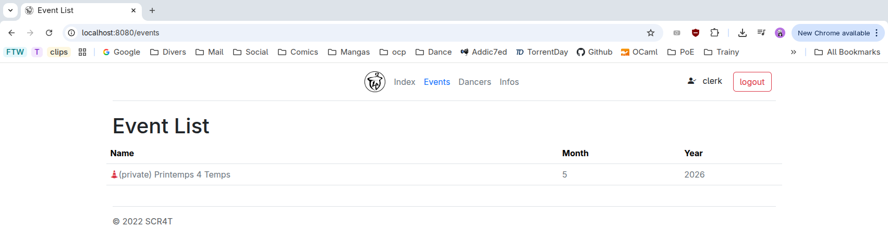
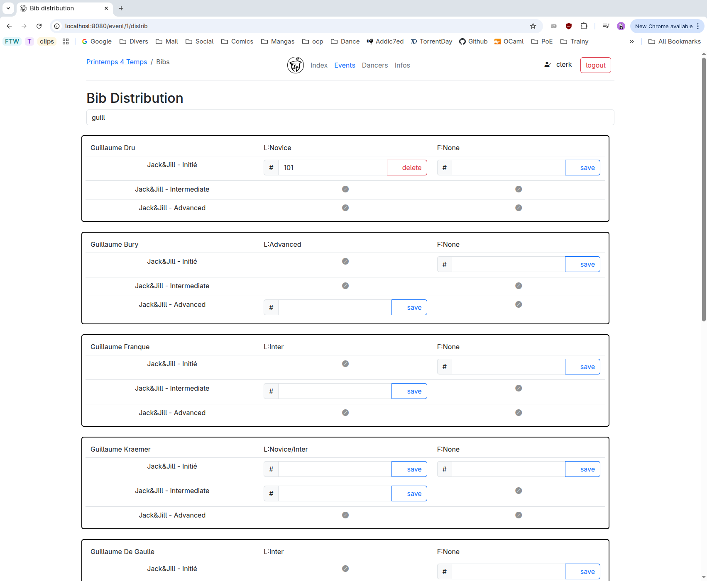
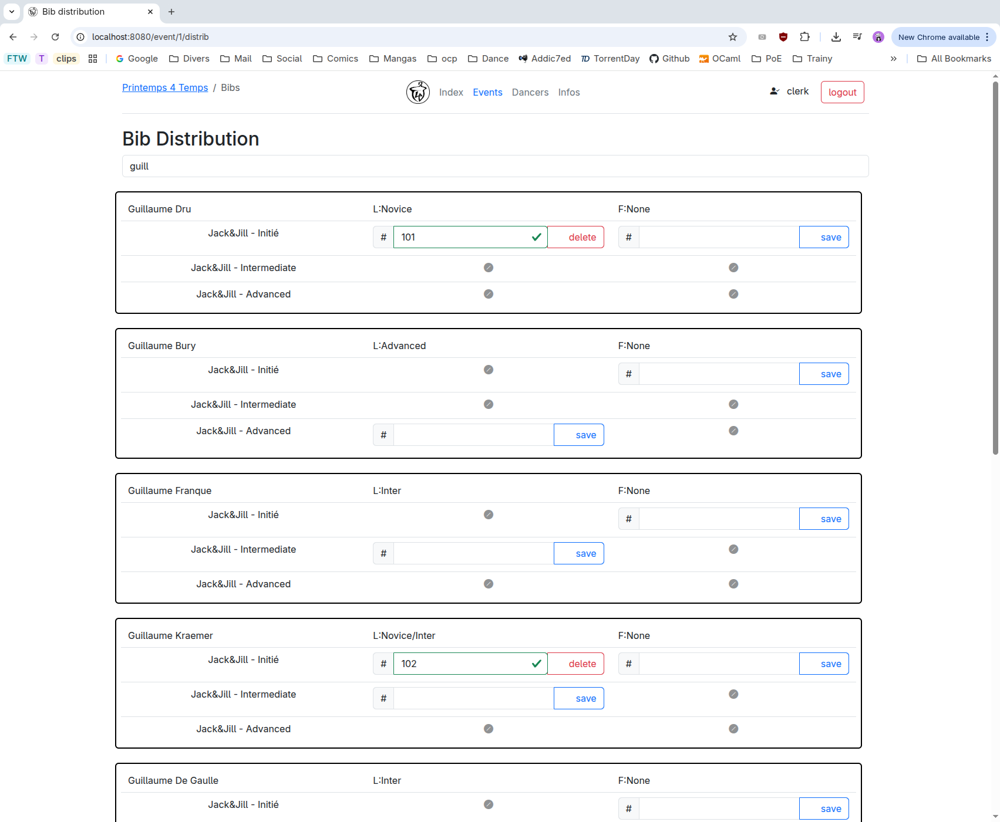
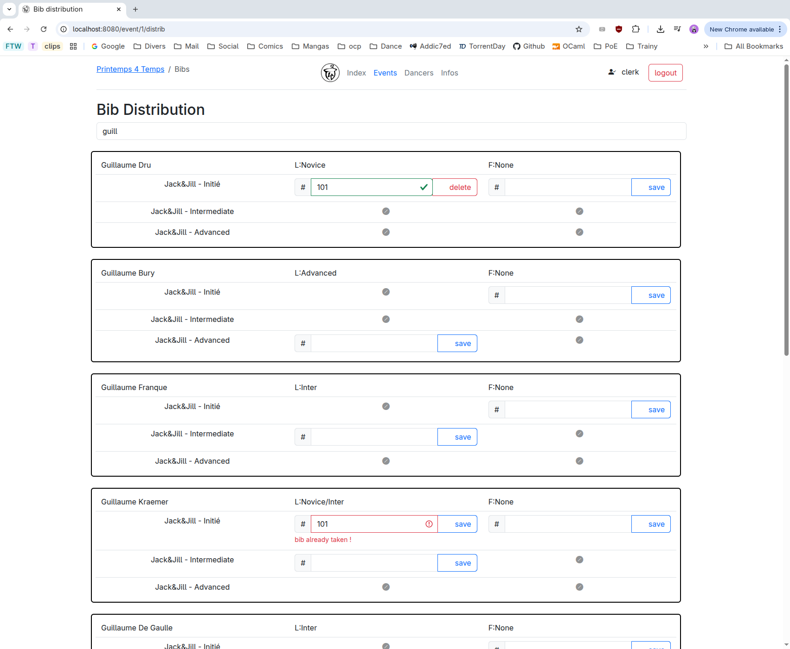
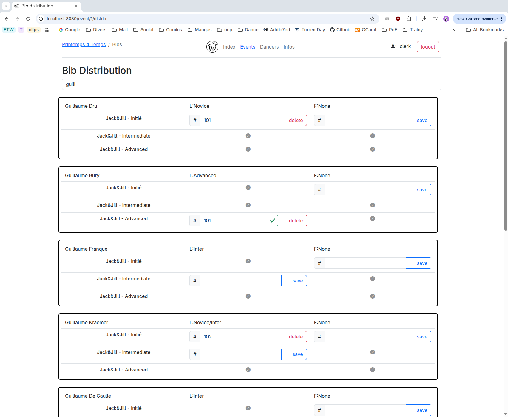

Distributtion de Dossards
=========================

1. Aller sur le site de scoring (à voir sur place avec le/la scoreur).
   

2. Si ce n'est pas déjà fait, se logger (via le bouton "Login")
   

3. Aller sur la liste des évents et cliquer sur le P4T. Attention, le P4T n'apparaitra pas si
   vous n'êtes pas loggé(e).
   
   
4. Sur la page du P4T, cliquer sur le lien "Bib distribution".
   

5. Sur la page ouvert, vous pouvez chercher des compétiteurs-trices dans la base de donner du SCR4T.
   Pour chaque compétiteur-trice, et pour chaque compétition, apparait soit:
   - une encart pour indiquer le numéor de dossard (aka "bib" en anglais). Si une personne a déjà un
     numéro de dossard, celui-ci est indiqué dans l'encart, et un bouton est disponible pour éliminer
     ce numéro de dossard.
   - ou bien une croix, indiquant que le/la personne n'as **pas** accès à la compétition/division
   

6. Pour rentrer un numéro de dossard, il suffit d'entre le numéro dans la case, puis d'appuyer sur "Entrée"
   ou bien appuyer sur le bouton "save". Une fois qu'une petite checkmark verte apparait à côté du numéro de dossard
   (et que le bouton "save" s'est transformé en "delete"), le dossard est enregistré et tout est bon !
   

7. Si jamais le numéro de dossard rentré existe déjà (**pour la même compétition**), alors une erreur
   est montrée
   

   ***Attention, il est pour l'instant possible de donner le même numéro de dossard à plusieurs personnes si
      ils/elles compétitent dans des compétition différentes***
   
   
