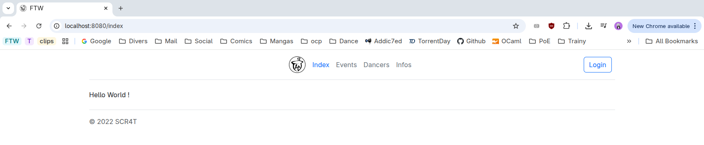
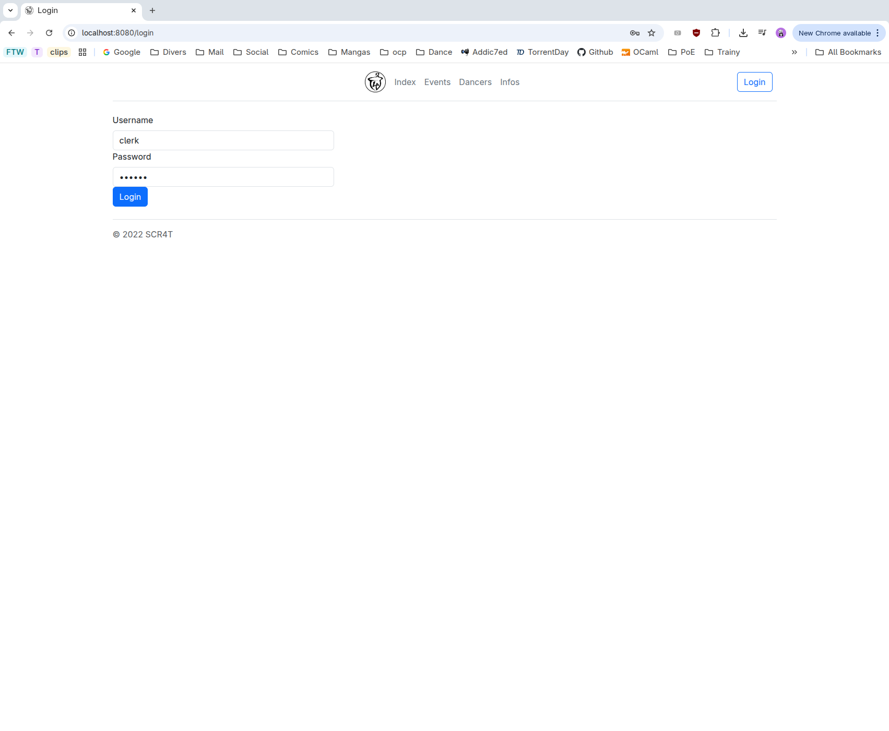
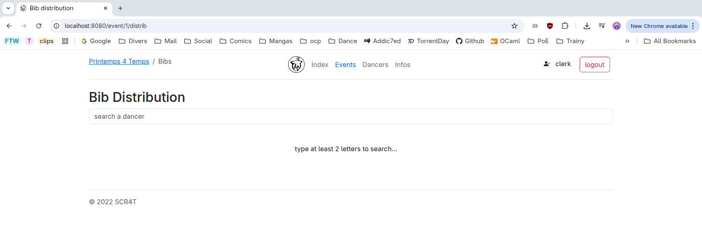

Distributtion de Dossards
=========================

1. Aller sur le site de scoring (à voir sur place avec le/la scoreur).
   

2. Si ce n'est pas déjà fait, se logger (via le bouton "Login")
   

3. Aller sur la liste des évents et cliquer sur le P4T. Attention, le P4T n'apparaitra pas si
   vous n'êtes pas loggé(e).
   ![FTW website event list](events.png
   
4. Sur la page du P4T, cliquer sur le lien "Bib distribution". Sur la page ouvert, vous pouvez
   chercher des compétiteurs-trices dans la base de donner du SCR4T
   